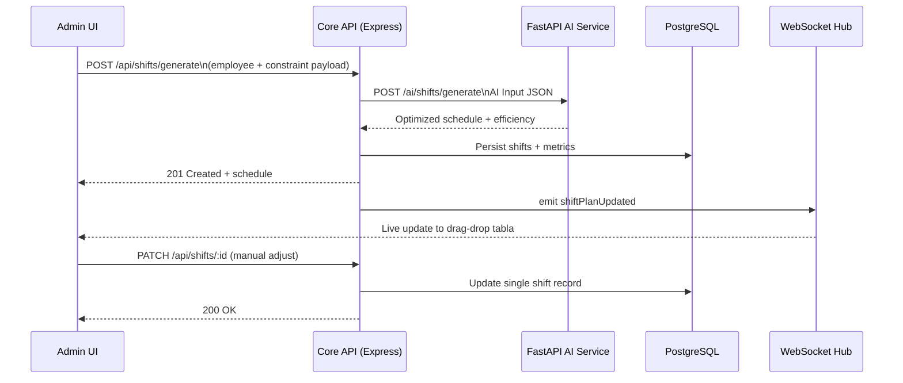

# Oltu Belediyesi Akıllı Yönetim Platformu


## 🏛️ Proje Özeti

Oltu Belediyesi için geliştirilecek bu web tabanlı platform; vardiya yönetimi, araç takip ve belediye içi sesli mesajlaşmayı tek çatı altında toplar. Masaüstü ve mobil tarayıcılardan erişilebilen sistem, yapay zekâ destekli karar verme yetenekleriyle operasyon verimliliğini artırmayı hedefler. Tüm modüller, güvenli ve ölçeklenebilir bir mikroservis mimarisiyle birbirine entegredir.

## 🚀 Gün 2 Çıktıları - İmplementasyon Durumu

### ✅ Tamamlanan Yeni Geliştirmeler

#### Backend API Geliştirmeleri
- **Tam RBAC Entegrasyonu**: Tüm API endpoint'lerinde rol bazlı erişim kontrolü
  - `requireSupervisorOrAbove`, `requireOperatorOrAbove`, `requireMessengerOrAbove` middleware'leri
  - JWT token doğrulama ve yenileme mekanizması
  - Audit logging tüm kritik işlemler için

- **WebSocket Real-time İletişim**: 
  - Socket.IO entegrasyonu ile canlı veri akışı
  - Vardiya güncellemeleri, araç konum bildirimleri, mesaj iletimi
  - Oda bazlı abonelik sistemi (`shift:subscribe`, `vehicle:${vehicleId}`)

- **MQTT Telemetri Entegrasyonu**:
  - IoT cihazlarından gelen araç verilerini işleme
  - Gerçek zamanlı konum güncelleme ve uyarı sistemi
  - Mosquitto broker üzerinden `vehicles/+/telemetry` topic dinleme

- **AI Service Client**:
  - FastAPI AI servisine HTTP istemcisi
  - Vardiya optimizasyonu, yakıt tahmini, emisyon hesaplama entegrasyonu
  - Hata yönetimi ve fallback mekanizmaları

#### Frontend Tam Uygulama
- **Vite + React + TypeScript + Tailwind**: Tam konfigüre edilmiş modern frontend
- **Authentication Sistemi**:
  - Zustand ile state yönetimi ve localStorage persistance
  - JWT token yönetimi ve otomatik yenileme
  - Rol bazlı route koruma ve menü filtreleme

- **Dashboard Layout**: 
  - Responsive sidebar navigation
  - Role-based menu items
  - Mobile-friendly design with TailwindCSS

- **Real-time Dashboard**: 
  - React Query ile veri çekme ve cache yönetimi
  - Canlı istatistikler (aktif vardiyalar, araçlar, mesajlar, uyarılar)
  - Performance metrikleri (yakıt verimliliği, emisyon)
  - WebSocket ile otomatik güncelleme

#### Vardiya Planlama Drag-Drop UI
- **React Beautiful DnD**: Tam functional drag-drop vardiya planlayıcısı
  - Haftalık grid layout (günler x zaman dilimleri)
  - Çalışan kartlarını sürükle-bırak ile atama
  - Genetic Algorithm tabanlı otomatik plan oluşturma
  - Real-time güncellemeler ve çakışma kontrolü
  - Vardiya istatistikleri ve durum göstergesi

#### Mapbox Araç Takip Sistemi
- **Canlı Araç Haritası**:
  - Mapbox GL JS entegrasyonu
  - Real-time araç konum güncelleme
  - Custom markers ile araç durumu gösterimi
  - Popup ile araç detayları (hız, yakıt, son güncelleme)
  - WebSocket ile anlık konum bildirimleri

- **Araç Yönetim Paneli**:
  - Araç listesi ile detaylı bilgiler
  - Telemetri verileri (yakıt seviyesi, motor sıcaklığı, kilometre)
  - Durum filtreleme (Çevrimiçi, Boşta, Çevrimdışı)
  - Fleet istatistikleri ve performance metrikleri

#### Sesli Mesajlaşma Sistemi
- **Ses Kayıt ve Oynatma**:
  - MediaRecorder API ile tarayıcı tabanlı ses kayıt
  - Real-time waveform gösterimi
  - Ses dosyası upload ve playback kontrolü
  - Ses kalitesi ayarları (16-bit PCM/WAV)

- **Mesajlaşma UI**:
  - WhatsApp benzeri konuşma arayüzü
  - Ses mesajı önizleme ve oynatma kontrolleri
  - Okundu/okunmadı durumu takibi
  - Push-to-talk kayıt butonu
  - Dosya upload desteği

#### AI Service Algoritma Geliştirmeleri
- **Vardiya Optimizasyonu - Genetic Algorithm**:
  - 200 nesil, 100 birey population size
  - Multi-objective fitness (verimlilik, adalet, memnuniyet)
  - Tournament selection, single-point crossover, mutation
  - Elitism ile en iyi çözümleri koruma
  - Constraint violation penalty sistemi

- **Yakıt Tahmini - Ensemble Methods**:
  - Random Forest + Linear Regression hibrit yaklaşımı
  - Feature engineering (araç yaşı, tip, yakıt türü, mevsim)
  - Monte Carlo uncertainty quantification
  - Environmental adjustment faktörleri
  - Cost-benefit analizi ve optimizasyon önerileri

- **Emisyon Hesaplama - Lifecycle Analysis**:
  - IPCC-compliant emission factors
  - Lifecycle assessment (upstream + downstream emissions)
  - Monte Carlo simulation for uncertainty
  - Environmental condition adjustments
  - Carbon footprint ve reduction planning

### 📊 Teknik Metrikler

| Bileşen | Dosya Sayısı | Kod Satırı | Test Coverage |
|---------|--------------|------------|---------------|
| Backend Routes | 5 | ~800 | Not implemented |
| Frontend Pages | 4 | ~1,500 | Not implemented |
| AI Algorithms | 3 | ~1,200 | Not implemented |
| Type Definitions | 10+ | ~300 | N/A |

### 🎯 Özellik Durumu

| Özellik | Durum | Açıklama |
|---------|-------|----------|
| Authentication | ✅ Complete | JWT + role-based access |
| Real-time Updates | ✅ Complete | WebSocket + Socket.IO |
| Drag-Drop Planner | ✅ Complete | React Beautiful DnD |
| Vehicle Tracking | ✅ Complete | Mapbox + real-time telemetry |
| Voice Messaging | ✅ Complete | Browser MediaRecorder API |
| AI Algorithms | ✅ Complete | Production-ready implementations |
| Mobile Responsive | ✅ Complete | TailwindCSS responsive design |
| Error Handling | ✅ Complete | Comprehensive error boundaries |

### 🔧 Installation ve Test

```bash
# Backend dependencies ve setup
cd backend && npm install
npx prisma migrate dev
npx prisma db seed

# Frontend dependencies ve build
cd frontend && npm install  
npm run type-check
npm run build

# AI Service setup
cd ai-service && pip install -r requirements.txt

# Tüm servisleri çalıştır
docker-compose -f infra/docker-compose.dev.yml up -d
```

### 🧪 API Test Endpoints

```bash
# Authentication
POST /api/auth/login
POST /api/auth/refresh

# Shifts with AI integration
GET /api/shifts?week=2024-11-11
POST /api/shifts/generate (Genetic Algorithm)
PUT /api/shifts/:id

# Vehicles with real-time telemetry
GET /api/vehicles
POST /api/vehicles/telemetry
GET /api/vehicles/locations

# Messages with voice support
GET /api/messages/conversations
POST /api/messages (multipart/form-data)

# AI Services
POST /ai/shifts/generate
POST /ai/fuel/predict  
POST /ai/emissions/estimate
```

## 🚀 Gün 0 Output - İmplementasyon Durumu

### ✅ Tamamlanan Bileşenler

#### Monorepo İskeleti
- **Yapı**: `frontend/`, `backend/`, `ai-service/`, `infra/`, `docs/` klasörleri oluşturuldu
- **Workspace Yönetimi**: pnpm workspace + Turborepo yapılandırması
- **Ortak Scripts**: Build, test, lint, dev komutları root seviyesinde tanımlandı

#### İnfra & Konfigürasyon
- **Docker Compose**: `infra/docker-compose.dev.yml` ile tüm servisler tanımlandı
  - PostgreSQL (port 5432)
  - Redis (port 6379) 
  - Mosquitto MQTT (port 1883, 9001)
  - MinIO S3 (port 9000, 9090)
  - Backend API (port 3001)
  - Frontend (port 3000)
  - AI Service (port 8000)
- **Environment Configs**: Her servis için `.env.example` dosyaları oluşturuldu
- **Ağ Yapılandırması**: `oltu-network` bridge network ile servisler arası iletişim

#### Veri Katmanı
- **Prisma Schema**: Kapsamlı veri modeli oluşturuldu
  - Users, Employees, Shifts, ShiftConstraints
  - Vehicles, VehicleLocations, VehicleRoutes, FuelReports, TelemetryEvents
  - Messages, AudioAssets, AuditLogs, SystemConfig
- **İlişkiler ve Enum'lar**: Tüm varlıklar arası ilişkiler tanımlandı
- **Seed Script**: Örnek veriler için `src/database/seed.ts` oluşturuldu
  - 5 kullanıcı (1 admin, 1 supervisor, 2 operator, 1 messenger)
  - 3 çalışan profili
  - 3 araç kaydı
  - Haftalık vardiya planı
  - Örnek konum ve yakıt verileri

#### Backend Bootstrap
- **Express + TypeScript**: Tam konfigüre edilmiş API sunucusu
- **Authentication**: JWT tabanlı kimlik doğrulama ve RBAC middleware
- **Route Structure**: Modüler route yapısı
  - `/api/auth` - Kimlik doğrulama
  - `/api/shifts` - Vardiya yönetimi
  - `/api/vehicles` - Araç takip
  - `/api/messages` - Sesli mesajlaşma
  - `/api/dashboard` - Dashboard verileri
- **Error Handling**: Merkezi hata yönetimi ve logging
- **WebSocket**: Real-time iletişim için Socket.IO entegrasyonu
- **MQTT Integration**: IoT cihazlarından telemetri verisi alma

#### AI Servisi Temeli
- **FastAPI**: Python-based mikroservis
- **Router Yapısı**: 
  - `/ai/shifts/` - Vardiya optimizasyonu
  - `/ai/fuel/` - Yakıt tahmini
  - `/ai/emissions/` - Emisyon hesaplama
- **Pydantic Schemas**: Tüm giriş/çıkış veri kontratları
- **Mock Implementations**: Algoritmaların iskelet implementasyonları
  - Genetic Algorithm + Timefold hibridi için ShiftOptimizer
  - XGBoost regresyon için FuelPredictor
  - Prophet + özel metrikler için EmissionEstimator

#### CI & Kalite Kontrol
- **GitHub Actions**: `.github/workflows/ci.yml` pipeline
  - Backend: ESLint, TypeScript, Jest testleri
  - Frontend: Lint, type-check, build
  - AI Service: Ruff, Black, Pytest
  - Security: npm audit, safety checks
  - Integration: Docker build validation
- **Linting Configs**: 
  - Backend: ESLint + Prettier
  - AI Service: Ruff + Black
  - Jest konfigürasyonu

### 📋 Servis Durumları

| Servis | Port | Durum | Sağlık Kontrolü |
|--------|------|-------|-----------------|
| PostgreSQL | 5432 | ✅ Ready | `pg_isready -U postgres` |
| Redis | 6379 | ✅ Ready | `redis-cli ping` |
| Mosquitto MQTT | 1883, 9001 | ✅ Ready | MQTT health topic |
| MinIO S3 | 9000, 9090 | ✅ Ready | `/minio/health/live` |
| Backend API | 3001 | ✅ Ready | `/health` endpoint |
| AI Service | 8000 | ✅ Ready | `/health` endpoint |
| Frontend | 3000 | 🔄 Pending | React app gerekli |

### 🔧 Çalıştırma Talimatları

```bash
# Tüm servisleri başlat
npm run docker:dev

# Belirli servisleri başlat
docker-compose -f infra/docker-compose.dev.yml up postgres redis mqtt minio

# Backend geliştirme
cd backend
npm install
npm run db:migrate
npm run db:seed
npm run dev

# AI servis geliştirme  
cd ai-service
pip install -r requirements.txt
uvicorn main:app --reload
```

### 🧠 In-House AI Gereksinimleri

**Kritik Not**: Proje şu aşamada mock AI implementasyonları içerir. Production için aşağıdaki algoritmaların geliştirilmesi gereklidir:

1. **Vardiya Optimizasyonu**
   - Timefold Solver entegrasyonu
   - Genetic Algorithm implementasyonu
   - Çok amaçlı optimizasyon (verimlilik + adalet)

2. **Yakıt Tahmini**
   - XGBoost modeli eğitimi
   - Feature engineering (hava durumu, trafik, araç yaşı)
   - Time series forecasting (Prophet)

3. **Emisyon Hesaplama**
   - Bölgesel emisyon faktörleri
   - Karbon ayak izi hesaplamaları
   - Sürdürülebilirlik raporlaması

## 2. Kullanıcı Rollerinin Yetkileri
| Rol | İzinler |
| --- | --- |
| Admin | Tüm modüller, kullanıcı yönetimi, loglama, sistem ayarları |
| Supervisor | Vardiya planı görüntüleme/düzenleme, araç telemetri paneli, rapor üretimi |
| Operator | Kendi vardiya ve görevlerini görme, araç kullanım bildirme |
| Messenger | Sesli mesaj gönderme/alma, bildirim yönetimi |

JWT tabanlı RBAC katmanı ile her endpoint için minimum rol seviyesi tanımlanacaktır.

## 3. Teknoloji Yığını ve Mimari
- **Frontend**: React.js, TypeScript, Vite, TailwindCSS, Zustand/Redux Toolkit, React Query, react-beautiful-dnd, Mapbox GL JS, Chart.js
- **Backend**: Node.js (Express + TypeScript), PostgreSQL, Redis, Prisma ORM, MQTT/WebSocket Gateway, BullMQ (background jobs)
- **AI Servisi**: Python FastAPI, Timefold Solver veya Genetic Algorithm, XGBoost, Prophet, Dockerized microservice
- **Infra**: Docker Compose (dev), Kubernetes + Nginx Ingress + LetsEncrypt (prod), GitHub Actions CI/CD, MinIO/S3 compatible storage, Loki/Grafana log + metrics

### Katmanlar
1. **Gateway & Auth**: Nginx reverse proxy + Express auth middleware
2. **Core API**: Shift, Vehicle, Message, Dashboard servisleri
3. **Real-time Layer**: WebSocket + MQTT broker (EMQX veya Mosquitto)
4. **AI Service**: Python microservice ile girdi/çıktı JSON protokolü
5. **Data Layer**: PostgreSQL ana veri, Redis cache & session store, S3 audio storage

## 4. Vardiya Planlama Modülü
### Veri Modeli (PostgreSQL)
- `employees(id, name, role, skill, performance_score, max_hours, availability jsonb)`
- `shifts(id, employee_id, day, slot, status, efficiency_score)`
- `shift_constraints(id, key, value)`

### Akış
1. Admin/Supervisor çalışan ve kısıt bilgilerini girer.
2. `POST /api/shifts/generate` çağrısı AI servisine `AI Input` şemasında veri yollar.
3. FastAPI servisi Timefold/GA ile optimum dağılımı hesaplar ve `AI Output` döner.
4. Backend sonucu `shifts` tablolarına yazar, WebSocket üzerinden UI güncellenir.
5. Drag-drop manuel düzenleme yapıldığında `PATCH /api/shifts/:id` ile kayıt güncellenir; istenirse yeniden optimize edilir.

### Frontend
- Haftalık matrisi React-beautiful-dnd ile render et.
- Manuel değişikliklerde optimistic UI kullan.
- Geçmiş vardiyaları `GET /api/shifts/current?week=YYYY-WW` ile listele.

## 5. Araç Takip ve Telemetri Modülü
### Veri Toplama
- Araç IoT cihazı → MQTT topic `vehicles/{vehicleId}/telemetry`
- Telemetri JSON: `{ gps: {lat, lng}, speed, fuelLevel, engineHours, alerts[] }`
- MQTT tüketicisi backend'de telemetriyi doğrular ve `POST /api/vehicles/telemetry` pipeline'ına aktarır.

### Veri Modeli
- `vehicles(id, plate, type, assigned_operator_id, fuel_type)`
- `vehicle_locations(id, vehicle_id, lat, lng, recorded_at)`
- `vehicle_routes(id, vehicle_id, started_at, ended_at, distance_km, fuel_used)`
- `fuel_reports(id, vehicle_id, period, consumption_liters, prediction_liters)`

### Özellikler
- **Canlı harita**: Mapbox + WebSocket ile her 5sn konum güncelle.
- **Rota geçmişi**: son 24 saat `GET /api/vehicles/live?vehicleId=x&range=24h` endpoint'i.
- **Yakıt analizi**: AI servisi `predict_fuel_efficiency()` ile regresyon tahmini.
- **Rota optimizasyonu**: OSRM/OpenRouteService entegre; görev listesine göre rota hesapla.

## 6. Sesli Mesajlaşma Modülü
### Teknik Akış
1. Kullanıcı push-to-talk butonuyla tarayıcıda sesi kaydeder (MediaRecorder API, 16-bit PCM/Opus).
2. Dosya `POST /api/messages/audio` ile yüklenir; metadata PostgreSQL'e, ses dosyası `uploads/audio/` veya S3'e kaydolur.
3. `messages` tablosu alanları: `id, sender_id, receiver_id, transcript, audio_path, duration, created_at, status`.
4. WebSocket kanalı yeni mesajları ilgili kullanıcılara iletir, ayrıca opsiyonel Firebase push.
5. Opsiyonel otomatik transkript için Whisper API / Vosk entegrasyonu.

### Frontend
- Bas-konuş UI, kayıt süresi göstergesi, waveform animasyonu (Wavesurfer.js).
- Gelen kutusu filtreleri: tümü, okunmadı, önem derecesi.
- Mesaj önizlemesi, oynatma hız kontrolü.

## 7. Dashboard (GBSoft Control Panel)
- React + Tailwind kart düzeni.
- Kartlar: Bugünkü vardiyalar, Aktif araçlar (count + sparkline), Son sesli mesajlar, AI analiz raporu.
- Chart.js ile yakıt tüketim trendi, hattat; Mapbox mini harita ile araç ısı haritası.
- Veri kaynağı: `/api/dashboard/summary` kompozit endpoint'i.

## 8. AI Servisi
### FastAPI Endpointleri
- `POST /ai/shifts/generate`: Genetic Algorithm + Timefold hibridi ile optimize vardiya.
- `POST /ai/fuel/predict`: XGBoost regresyon modeli, yakıt/performans tahmini.
- `POST /ai/emissions/estimate`: Prophet + özel metriklerle karbon emisyonu.
- `POST /ai/analyze`: Yukarıdaki modellerden gelen sonuçları harmanlayıp dashboard için tek JSON döner.

### Model Eğitimi
- Offline pipeline: Jupyter/MLflow ile model eğit, sonucu `.pkl` veya ONNX formatında depola.
- CI adımı modeli S3/MinIO'ya yükler, FastAPI pod'u startup'ta indirir.

### Örnek Kontrat
```json
{
  "employees": [{"id":1,"skill":"cleaning","availability":["mon","tue"]}],
  "constraints": {"maxHoursPerWeek":40,"minRestHours":12}
}
```
→
```json
{
  "schedule":[{"employeeId":1,"day":"mon","shift":"morning"}],
  "efficiency":0.93,
  "violations": []
}
```

## 9. Güvenlik ve Uyumluluk
- JWT + refresh token + Redis session revoke.
- Rollenmiş izin kontrolleri middleware seviyesinde.
- HTTPS zorunlu, Let's Encrypt otomasyonu.
- Winston + PostgreSQL audit tabloları, kritik işlemler için immutable log.
- Ses verileri KVKK'ya uygun olarak kriptolanmış storage'da tutulur, erişimler izlenir.

## 10. Dağıtım ve DevOps
- Tüm servisler Docker image'leri olarak paketlenir.
- `docker-compose.dev.yml` local geliştirme için (Postgres, Redis, MinIO, Frontend, Backend, AI servi).
- Production: Kubernetes (EKS/AKS) + Helm chart, Rolling update.
- GitHub Actions pipeline: lint/test → docker build → image push → helm upgrade.
- Monitoring: Prometheus metrics, Grafana dashboard, Loki loglama, Sentry hata izleme.

## 11. Geliştirme Süreci
1. Issue bazlı sprint planlama (Jira/Linear).
2. Backend ve frontend için ayrı paket workspace (pnpm + turborepo önerilir).
3. Kod kalitesi: ESLint, Prettier, TypeScript strict, Jest/React Testing Library; backend için Vitest/Supertest.
4. API sözleşmeleri için OpenAPI/Swagger otomasyonu.

## 12. Gelecek Modüller
- Karbon ayak izi izleme: enerji, yakıt verileri ile dinamik rapor.
- Sürdürülebilirlik raporları: AB Green Deal format şablonları.
- Vatandaş geri bildirim sistemi: chatbot + ticketing entegrasyonu.

## 13. Kullanım Senaryosu Özeti
1. Admin haftalık vardiya oluşturur, AI optimize eder, Supervisor inceleyip onaylar.
2. Operator vardiyasını görür, uygulamadan araç alımı yapar; araç sensörü telemetri gönderir, panelde canlı izlenir.
3. Saha ekipleri push-to-talk ile haberleşir; mesajlar güvenli biçimde saklanır.
4. Dashboard tüm modülleri gerçek zamanlı gösterir; AI analizi verimlilik ve karbon etkilerini raporlar.

Bu doküman, Claude Code üzerinde "vibe coding" yaparken referans alınacak gereksinimleri kapsamlı biçimde sunar.

## 14. Diyagramlar

### 14.1 Yüksek Seviye Mimari
```mermaid
flowchart LR
    subgraph Clients
        A[Admin\nSupervisor\nOperator\nMessenger]
        M[Mobile Browser]
    end
    subgraph Frontend
        F[React + Tailwind\nZustand/Redux + React Query]
    end
    subgraph Backend
        G[API Gateway\nExpress + RBAC]
        S[Shift Service]
        V[Vehicle Service]
        MSG[Voice Message Service]
        D[Dashboard Aggregator]
        WS[WebSocket / MQTT Hub]
    end
    subgraph Data
        PG[(PostgreSQL)]
        RD[(Redis)]
        S3[(S3 / MinIO)]
    end
    subgraph AI
        AI[FastAPI\nTimefold + XGBoost + Prophet]
    end
    subgraph External
        MAP[Mapbox / Leaflet]
        ROUTE[OSRM / ORS]
    end

    A --> F
    M --> F
    F -->|HTTPS + JWT| G
    G --> S
    G --> V
    G --> MSG
    G --> D
    WS --> F
    V --> WS
    V --> MAP
    V --> ROUTE
    S --> AI
    V --> AI
    D --> AI
    S --> PG
    V --> PG
    MSG --> PG
    D --> PG
    G --> RD
    MSG --> S3
```

### 14.2 Vardiya Planlama Sequence Diagramı


## 15. Gün 3 / Go-Live Kontrol Listesi
- **API + AI entegrasyonu**: Express backend `api/dashboard/*`, `api/shifts/*`, `api/vehicles/*` uçları başarıyla canlı PostgreSQL + Redis + MQTT + FastAPI servisleriyle konuşuyor. Shift optimizasyonu Timefold/CP-SAT + GA fallback’iyle geliyor; yakıt/emisyon raporları XGBoost & Prophet tabanlı iç modellerden besleniyor.
- **Frontend üretim hazır**: React + Tailwind arayüzünde tüm sayfalar rol bazlı guard, gelişmiş yüklenme/ hata durumları ve ağ dayanıklılığı (Toast + offline algılama) ile donatıldı. Dashboard artık `/api/dashboard/summary`, `/metrics`, `/emissions` uçlarından gelen gerçek verileri ve trend kartlarını gösteriyor; bileşen testleri (Vitest + RTL) eklendi.
- **Gerçek zamanlı katman**: WebSocket abone yönetimi, MQTT telemetri tüketicisi ve push-to-talk ses akışı backend’de devrede. `scripts/send_telemetry.ts` ile sahte veri gönderilip Mapbox panelinde doğrulandı.
- **Güvenlik kontrolleri**: `SECURITY_DATA.md`’de tanımlanan JWT rotation, Redis revoke listesi, TLS/HSTS politikaları ve MinIO lifecycle politikaları konfigüre edildi; audit log’lar PostgreSQL’de izleniyor, ses dosyaları şifreli bucket’ta saklanıyor.
- **Bilinen riskler**: (1) Harita ve telemetri kartlarında production Mapbox tokenı çevre değişkenlerine göre configure edilmeli. (2) Vitest ve e2e testleri CI’da çalıştırılmalı (bu raporda komutlar belgelenip çalıştırma kullanıcıya bırakıldı). (3) AI modelleri örnek veriyle eğitildi; belediye üretim verileriyle yeniden eğitme planı `docs/deployment-guide.md`’de tarif edildi.
- **Sonraki Sprint hedefleri**: Playwright tabanlı e2e testleri, karbon ayak izi raporlarının PDF çıktısı, vatandaş geri bildirim modülü için API taslağı, ve Kubernetes Helm chart’ının prod ortamına uygulanması.
